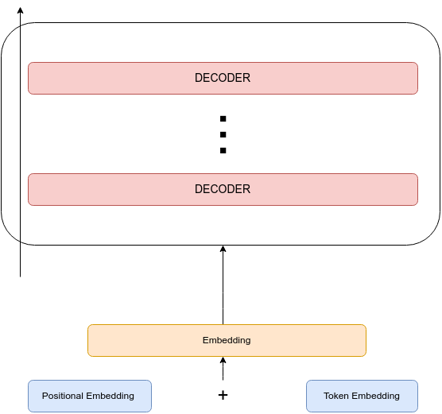

# TinyGpt
This repository contains an implementation of TinyGPT, a small-scale GPT model created from scratch

  

## Configuration

  <table style="width:100%">
    <tr>
      <th>Setting</th>
      <th>Value</th>
    </tr>
    <tr>
      <td>attn_dropout</td>
      <td>0.1</td>
    </tr>
    <tr>
      <td>embed_dropout</td>
      <td>0.1</td>
    </tr>
    <tr>
      <td>ff_dropout</td>
      <td>0.1</td>
    </tr>
    <tr>
      <td>vocab_size</td>
      <td>100</td>
    </tr>
    <tr>
      <td>max_len</td>
      <td>20</td>
    </tr>
    <tr>
      <td>num_heads</td>
      <td>12</td>
    </tr>
    <tr>
      <td>embed_dim</td>
      <td>768</td>
    </tr>
    <tr>
      <td>num_decoder_blocks</td>
      <td>12</td>
    </tr>
  </table>

